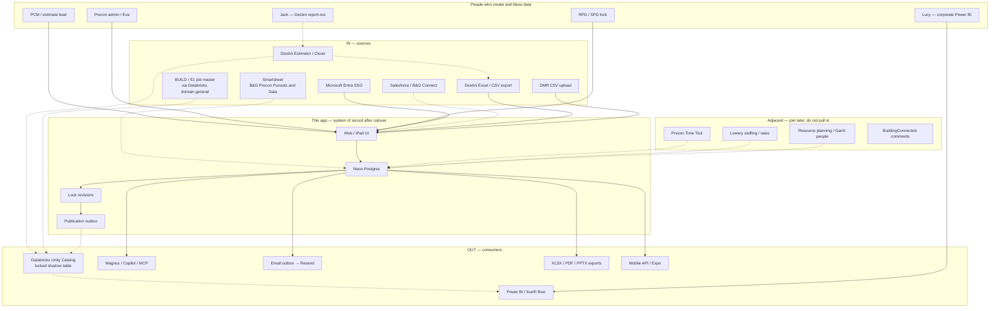
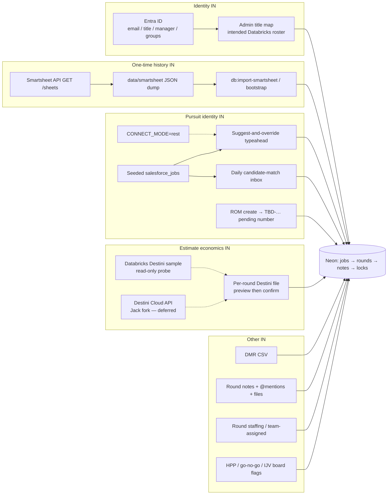
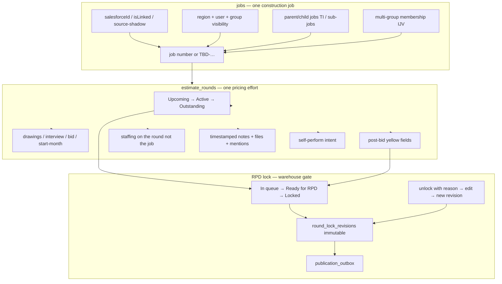
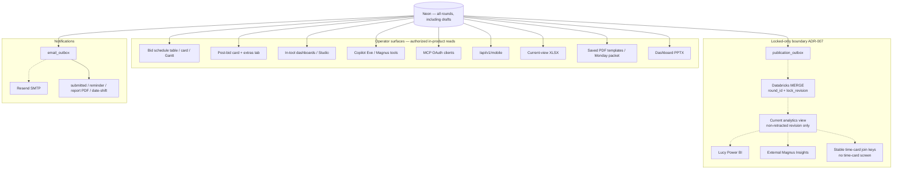
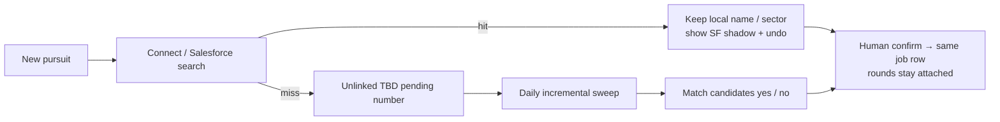
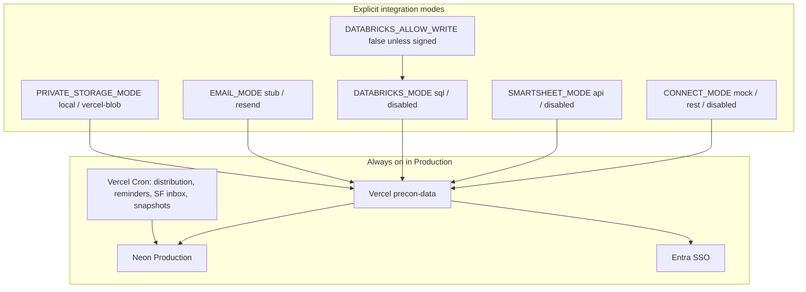

# Data connections and flows

Maps every inbound and outbound data point for **B&G Precon — Pursuits & Data**.

**Authority:** [2026-08-19 Post-Bid RPD Roundtable](../README.md) (Think Tank; all five RPDs plus Jay, Lucy, Jack, Eva, Keller). Product contract: [rpd-roundtable-product-contract.md](rpd-roundtable-product-contract.md). Vault distill: `B&G/10 Meetings/2026-08-19 Post-Bid RPD Roundtable.md`.

The room named the product as **bid schedule + data collection + reporting**. The bid schedule is already the unofficial project directory. Do not grow a fifth ecosystem (time cards, Lowery staffing, Destini Cloud, resource Gantt stay adjacent).

Solid arrows = live in this repo. Dotted arrows = designed and gated, not production. Dashed arrows = seeded / mock / file-only.

---

## How to read the colors

| Style | Meaning |
| --- | --- |
| Green | Live path (code + a configured deployment can use it) |
| Amber | Adapter exists; production still mock, file, or unsigned |
| Gray dotted | Roundtable-approved, blocked on credentials or owner sign-off |
| Red | Adjacent system. Do not ingest or write |

---

## 1. System context — every system that touches this app



**Roundtable clock that this picture serves**

| When | Data implication |
| --- | --- |
| Now | App is usable on Neon. Smartsheet still readable. Salesforce and Databricks write are **not** blockers to using the tool. |
| November | Lucy needs Databricks so Power BI does not drop in the Smartsheet transition. |
| After one signed dump | Import Smartsheet once (live + historical), then **never import again**. 2026 cutover allowed; January 1 is not a gate. |

---

## 2. Inbound — what enters the app



### 2.1 Smartsheet — replace, do not keep as SoR

Official workspace: **B&G Precon Pursuits and Data**. Today it is still the operating system (regional bid schedules + post-bid yellows + corporate estimate metrics). Bryan touches the corporate sheet multiple times a day; formula copy-down already corrupts numbers.

| | |
| --- | --- |
| Direction | **IN only.** The app never writes Smartsheet. |
| Code | `src/lib/integrations/smartsheet/` — list, pull, parse |
| Mode | `SMARTSHEET_MODE=disabled \| api` |
| Cutover | One complete history dump, checksum, isolated reconcile, then disable reads. [smartsheet-cutover.md](smartsheet-cutover.md) |
| Gate | `SMARTSHEET_DUMP_SIGNED_OFF=1` plus a green dump report. Software rehearsal is not Production sign-off. |
| Isolated rehearsal (this machine) | 640 jobs / 1098 rounds after merge; `mayDisableReads` stayed false because the owner gate is unset. |

DEC: **App replaces Smartsheet with 2026 cutover allowed.**

### 2.2 Salesforce / Connect — suggest, do not chain

The room will not wait for Salesforce cleanup and will not own cleaning it. **Job number is the only field they trust.** Name, client, division, and market sector are often wrong. Duplicate job numbers exist. HPP list is moving into Salesforce.

| | |
| --- | --- |
| Direction | **IN, read.** No Salesforce write. Official project start stays in Salesforce ([DEC-2026-08-06](../README.md)). |
| Seam | `src/lib/integrations/connect/` — mock (seeded `salesforce_jobs`) or REST (`CONNECT_MODE=rest`) with mock fallback |
| Live gap | Unity Catalog probe found **no** Salesforce / Connect pursuit tables. Robert still needs production Salesforce **read** access (contract 4.6; operational, not a software gate). |
| Product rules | Typeahead suggestions. Local text may override / unlink. Job number is authoritative. Other SF fields are source-shadow, never silent overwrite. Daily candidate-match with human yes/no. No fake job number — unlinked create is `TBD-…` rendered as pending. |
| Cron | `/api/jobs/salesforce-sync` daily `15 11 * * *` UTC — incremental inbox sweep |

### 2.3 Destini — file now; live SQL vs Cloud API is Jack's fork

Leads will not wait until tomorrow to fill contingency. Jack owns whether Destini Cloud API (live) or next-day Databricks wins for “I need it now” fields. GC/GR B&G sort should be **automated from Destini** on the parent estimate, not typed.

| | |
| --- | --- |
| Direction | **IN**, human-confirmed. Local identity and previously accepted decisions win. |
| Live path | Per-round Excel/CSV: preview diffs, then confirm. Provenance on `source_provenance` + `integration_import_batches` (checksum, idempotent). [destini-adapter.md](destini-adapter.md) |
| Writable keys | Estimate value, fee back-page, craft labor, GC B&G sort, owner-SOV GC/GR (history only), PM months, field supervision, precon/design cost, duration, GSF, keys, AFM months, peak manpower |
| Not this adapter | A second live-SQL path. Do not add one until the contract is updated (contract 14.2 / 11.D5 deferred). |
| Databricks | Read-only probe of `domain.preconstruction.destiniestimates` (~10.6k), calculated metrics, ~2.8M cost items. Not an auto-fill of the round. |

### 2.4 BUILD / E1 job master — warehouse inventory, not a live join

Probed in the same SQL warehouse as the Precon Time Tool. Useful later for region, sector, city, IJV, team roster. **Not wired** as an inbound feed. Join key in UC is `ParentJobNumber / JobNumber` — the same number Precon often does not have yet.

### 2.5 DMR — optional reconcile, not the pipeline

CSV upload (`jobNumber,dmrValue`) into `dmr_imports` / `dmr_lines`. Reconcile vs Precon unhedged pipeline. Prospective / Committed / WUC as a Destini-or-DMR source is **deferred** (contract 11.D2). DMR is hedged; this collection is the unhedged priced pipeline.

### 2.6 Identity

Production: Microsoft Entra via Better Auth (`AUTH_MODE=sso`). Role mapping is fail-closed: email override → governed title → manager email → Entra groups. Roundtable: “admin from Databricks titles.” The adapter is the title map, not a live HR table pull.

---

## 3. Canonical store — what the app actually holds

Neon (Databricks-acquired) is the application database. Local demo uses PGlite. Preview uses a Neon **branch**, never Production.



Smartsheet needed two sheets (holding tank vs memorialized) because it is not a database. **The app does not.** One module, status not a copy: in queue → ready for RPD → **locked**. Unlock → edit → re-lock is a **change log**, not a second row. DEC: **Post-bid and metrics are one RPD-lock module.**

Chiefs / seniors do not lock. RPD glance-and-sign is the warehouse gate. Fourth floor, Power BI, and Magnus analytics see **RPD-approved** only. RPDs still see their regional slice of the **same** numbers (Florida ≠ Texas dashboards, same source).

Related ADRs: [003](adr/003-canonical-one-job-schedule-projection.md) one job row on the board, [004](adr/004-approval-requests-separate-from-round-status.md) create/edit proposals, [005](adr/005-organization-membership-vs-region-visibility.md) groups ≠ visibility ≠ staffing, [006](adr/006-versioned-lock-revisions-and-publication-outbox.md) revisions + outbox, [007](adr/007-locked-only-databricks-publication.md) locked-only warehouse.

---

## 4. Operator lifecycle — how a row moves

```mermaid
sequenceDiagram
  autonumber
  actor PCM as PCM / lead
  actor Admin as Regional admin
  actor RPD as RPD / SPD
  participant App as App / Neon
  participant SF as Salesforce lookup
  participant Destini as Destini file
  participant WH as Databricks
  participant PBI as Power BI
  participant Mag as Magnus / fourth floor

  PCM->>SF: Typeahead (if a number exists)
  alt No job number yet
    PCM->>App: Two-second ROM create (TBD, not a fake number)
  else Match found
    PCM->>App: Accept suggestion or local override
  end
  App-->>RPD: Pending proposal until approve-onto-board
  PCM->>App: Upcoming dates, SP intent, round team
  PCM->>App: Submit → Outstanding + post-bid queue
  opt Atlanta / Florida pattern
    Admin->>Destini: Import export, send to lead
    Admin->>App: Key / bless "Posted for RPD review"
  end
  PCM->>App: Fill phase-scaled required fields
  RPD->>App: Lock (local transaction; never waits on warehouse)
  App->>App: Immutable revision + outbox event
  App-->>WH: Async MERGE of that revision only
  WH-->>PBI: Current locked view
  Mag-->>WH: Ask-the-data on locked rows
  opt Later outcome / start / awardability
    RPD->>App: Unlock with reason, edit, re-lock as next revision
  end
```

Florida: Eva keys, Christi or Chris bless before corporate (~197 posted / six months). Atlanta: form → queue → Kelsey sends the sheet to the lead so the director only approves. Texas: ~40 behind. Conceptual budgets must not be forced to type zeros that wreck formulas.

---

## 5. Outbound — what leaves the app



### 5.1 Databricks publication

| | |
| --- | --- |
| Direction | **OUT**, locked revisions only. |
| Kill switch | `DATABRICKS_ALLOW_WRITE=false` (default). Also needs `warehousePublication` rollout + `DATABRICKS_MERGE_SIGNED_OFF`. |
| Shape | One wide row per locked round (Estimate Summary grain). Custom columns as JSON. Metrics as `metric_*`. Includes `job_id`, `job_number`, `round_id`, `lock_revision` for a future time-card join. |
| Semantics | Idempotent MERGE on round + revision. Unlock retracts the current view without destroying history. Local lock **never** waits on the warehouse. |
| Cron | `/api/jobs/databricks-sync` is **preview-only**. Do not put a mutating write on Vercel Cron while write is false. |
| Power BI | Switches only after frozen-fixture metric parity (`LUCY_FROZEN_FIXTURE_SIGNED_OFF` + `POWERBI_PARITY_SIGNED_OFF`). Dual analytics: RPDs in-tool, DMs/fourth floor in Power BI, **same numbers** ([DEC-2026-08-05](../README.md)). |

Warehouse tables already inventoried (read, not this app's write target): Destini estimates/metrics/cost items, BUILD project + team, division structure, BuildingConnected projects, potential awards. **Not found:** Salesforce opportunity tables, Smartsheet export tables.

### 5.2 Magnus, Eve, MCP, tokens

Roundtable: this tool is the **operator visualization**; Magnus is **ask-the-data later**. Redundancy is a live question. External Magnus/Copilot analytics must use the **current locked** boundary; in-product operator Copilot stays a separately authorized path.

| Surface | Auth | Data |
| --- | --- | --- |
| `/copilot` Eve (local) | Session + HMAC tool bridge | Principal-scoped tools: efforts, staffing, notes, person history, chart plan |
| `/api/v1/ai/magnus` | Session or `pcn_` token | Same tools; Vercel fallback when Eve is down |
| `POST /api/mcp` | Entra OAuth, not PAT | Read scopes default; writes opt-in; same kernel as web |
| `/api/v1/pursuits` | `pcn_` scopes | Region-filtered list |

Never grant Magnus `write:destructive`. A Magnus write-back that can delete a Smartsheet is the named nightmare; this app's token model exists so that cannot happen here.

### 5.3 Files, email, mobile

- **XLSX:** one click, current visible schedule, no popup.
- **PDF:** saved templates for the Monday packet; Chromium on Vercel (`@sparticuz/chromium`).
- **PPTX:** Studio / dashboard export, B&G 2026 brand kit.
- **Email:** durable `email_outbox` first. `EMAIL_MODE=stub` until Resend. Kinds: submitted, reminder, report PDF, report schedule, date-shift. Cron: hourly distribution + weekday 8am Chicago reminders.
- **Attachments:** `PRIVATE_STORAGE_MODE=local` today; `vercel-blob` when note files must survive serverless.
- **Mobile:** `/api/v1/mobile/*` exists. Web/iPad is the rollout; native is compatible but not PCM day one.

### 5.4 Future joins that must not become screens

| Consumer | Join | Rule |
| --- | --- | --- |
| Precon Time Tool | `job_id`, `job_number`, `round_id`, `lock_revision`, bid/drawings dates, start month | Preserve keys. Do **not** add a time-card screen. |
| Resource management | Canonical schedule date change event | Emit; never auto-slide people. |
| Katie Wells / BDC / scheduling | Bid schedule + nested self-perform (when mocked policy is approved) | Share the same job; do not duplicate rows. |

---

## 6. Salesforce match — identity without a second PK



Views follow **assigned people / groups**, not Salesforce house region (Georgia = All + MCI / Commercial / Healthcare). Dallas + Georgia on one job = **one data instance**.

---

## 7. What is deliberately not connected

These came up in the roundtable or adjacent meetings. They are not data paths in this product.

| System | Why it stays out |
| --- | --- |
| Precon Time Tool | Later true level-of-effort. Join keys only. |
| Lowery Precon App | Separate staffing / equipment / rates product. Not the post-bid replacement. |
| Resource-planning Gantt of people | Parking lot. Schedule Gantt of **jobs** is in-product. |
| Destini Cloud as SoR | Jack's transport decision; this app does not rewrite Destini. |
| BuildingConnected comments | Named anti-pattern for notes. UC has BC project tables; not an inbound comments feed. |
| Owner-SOV GC/GR as required | Lucy: apples-to-oranges. Drop from lock gate; keep history. |
| Minting job numbers | Salesforce remains official start. |

---

## 8. Connection inventory

| System | Dir | Status today | Env / gate | Roundtable owner |
| --- | --- | --- | --- | --- |
| Operators (web / iPad) | IN/OUT | Live | Entra SSO on Production | Keller / RPDs |
| Neon Postgres | store | Live | `DATABASE_MODE=postgres` | Platform |
| Microsoft Entra | IN | Live on Production | `AUTH_MODE=sso` | IT / Better Auth |
| Smartsheet | IN | Read/pull; unsigned cutover | `SMARTSHEET_MODE`, `SMARTSHEET_DUMP_SIGNED_OFF` | Bryan / Keller |
| Salesforce / Connect | IN | Seeded mock; REST adapter ready | `CONNECT_MODE`, production read access | Robert + Eric; escalate Keller/Bryan |
| Destini file import | IN | Preview/confirm | checksum batches | Jack / leads |
| Destini Cloud API | IN | Deferred | contract 14.2 | Jack |
| Databricks Destini/BUILD read | IN probe | Inventory + sample SELECT | `DATABRICKS_MODE=sql` | Eric |
| Databricks locked publish | OUT | Code behind flags; write off | `DATABRICKS_ALLOW_WRITE`, `DATABRICKS_MERGE_SIGNED_OFF` | Lucy / Eric — November |
| Power BI | OUT | Still on Smartsheet path | `POWERBI_PARITY_SIGNED_OFF`, `LUCY_FROZEN_FIXTURE_SIGNED_OFF` | Lucy |
| In-tool dashboards | OUT | Live | leadership latest-round rollup | RPDs |
| Magnus / Eve copilot | OUT | Live; locked-only for external analytics | AI Gateway | Philip / Innovation |
| MCP | OUT | Live OAuth | Admin MCP ceiling | Platform |
| Email | OUT | Outbox stub | `RESEND_API_KEY` | Ops |
| XLSX / PDF / PPTX | OUT | Live | Chromium on Vercel | Jay / Monday packet |
| DMR CSV | IN | Live upload | — | Greg / DMs (compare later) |
| Mobile API | OUT | Exists, not PCM day one | `/api/v1/mobile` | — |
| Vercel Blob | store | Local disk | `BLOB_READ_WRITE_TOKEN` | Platform |
| Time cards | OUT keys | Keys only | `src/lib/time-card-join.ts` | Jay-group later |
| BUILD / E1 | IN later | UC tables probed | — | Eric |
| BuildingConnected | none | UC tables exist; unused | — | — |

Fail-closed owner gates (CI does not set these): see [checklists/operational-signoff.md](checklists/operational-signoff.md).

---

## 9. Runtime modes (the actual wires)

From `.env.example` / [github-and-vercel.md](github-and-vercel.md):



Production never infers a live integration from an unset variable. Unset is explicit disable / mock / stub.

---

## Related

- Product contract: [rpd-roundtable-product-contract.md](rpd-roundtable-product-contract.md) sections 4, 9, 14
- Destini adapter: [destini-adapter.md](destini-adapter.md)
- Smartsheet cutover: [smartsheet-cutover.md](smartsheet-cutover.md)
- Warehouse ADR: [adr/007-locked-only-databricks-publication.md](adr/007-locked-only-databricks-publication.md)
- Field inventory in UC: `src/lib/integrations/databricks/field-map.ts`
- Hosting: [github-and-vercel.md](github-and-vercel.md)
